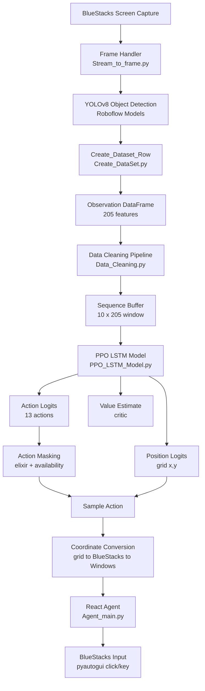
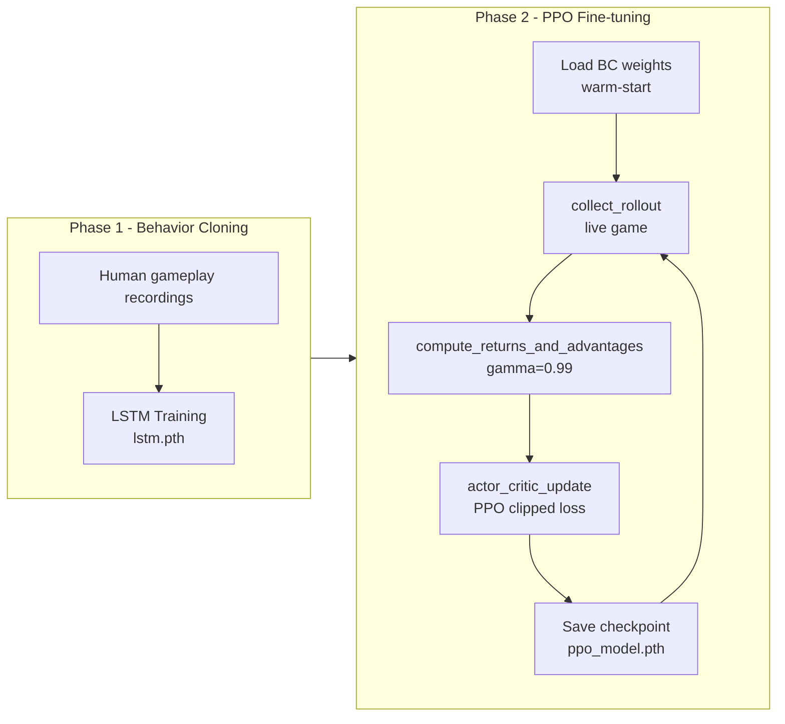

# Clash Royale RL Agent

A full reinforcement learning pipeline that plays **Clash Royale** autonomously on a Windows PC via BlueStacks. The agent starts from a **Behavior Cloning (BC)** warm-start — an LSTM trained on human gameplay — and is then fine-tuned using **Proximal Policy Optimization (PPO)** with live game interaction.

---

## Architecture Overview



---

## Training Pipeline



---

## Project Structure

```
Reinforcement-Learning-AiAgent/
│
├── Ai/
│   ├── Agent/
│   │   ├── Agent_main.py           # react_agent: executes actions via pyautogui
│   │   ├── coordinate_utils.py     # grid -> BlueStacks -> Windows coord conversion
│   │   └── LSTM_Inference_Pipeline.py
│   │
│   ├── Behavior_Cloning/
│   │   ├── LSTM_Model.py           # BC LSTM architecture
│   │   ├── LSTM_Train.py           # BC training script
│   │   ├── action_masking_config.py # Shared masking config (AVAIL_FEATURE_TO_ACTION_ID)
│   │   └── lstm.pth                # Trained BC weights (warm-start)
│   │
│   ├── RL/
│   │   ├── PPO_LSTM_Model.py       # Actor-critic LSTM (loads BC weights)
│   │   ├── PPO_Trainer.py          # clean_obs, build_action_mask, actor_critic_update
│   │   ├── PPO_Main.py             # Main training loop: collect -> update -> save
│   │   ├── ClashRoyalEnv.py        # Gym-style environment wrapper
│   │   ├── Reward_System.py        # compute_step_reward (tower HP diff)
│   │   ├── PPO_Logger.py           # JSON logging: updates, rollouts, win rate
│   │   └── logs/
│   │       ├── updates.json        # One entry per training run
│   │       ├── rollouts.json       # One entry per rollout
│   │       └── winrate.json        # Win/loss/draw history
│   │
│   ├── Roboflow/                   # YOLOv8 model wrappers for game detection
│   ├── ClashRoyalData.py           # ElixirCost, card metadata, feature schemas
│   ├── Create_DataSet.py           # Builds observation row from a game frame
│   ├── Data_Cleaning.py            # final_clean pipeline (slot, positions, avab)
│   ├── Stream_to_frame.py          # Captures BlueStacks frame to temp PNG
│   ├── check_status.py             # Win/loss detection from screen
└─── State_Tracker.py
│
├── requirements.txt
├── .env.example
└── README.md
```

---

## Observation Space

Each game frame is processed into a **205-feature vector**:

| Feature group | Description |
|---|---|
| `slot_1..4` | Cards currently in hand (cleaned to card availability flags) |
| `Elixir` | Current elixir count (0–10) |
| `ally/enemy tower HP` | 6 tower health values |
| `{troop}_ally/enemy` | Presence flag for each of 11 troop types per side |
| `{troop}_ally/enemy_x/y` | Grid position (9×18 grid) of each troop |
| `{troop}_ally_enemy_{troop}_d` | 11×11 pairwise distance matrix between ally and enemy troops |
| `{card}_avab` | Binary: can this card be played right now (in hand + enough elixir) |

A sliding window of the last **10 frames** is stacked into a `[10, 205]` tensor as LSTM input.

---

## Action Space

13 discrete actions:

| ID | Action |
|---|---|
| 0 | Wait |
| 1 | Play Mini Pekka |
| 2 | Play Knight |
| 4 | Play Goblins |
| 5 | Play Giant |
| 6 | Play Spear Goblins |
| 7 | Play Archers |
| 9 | Play Minions |
| 10 | Play Musketeer |
| 11 | Play Goblin Cage |
| 3, 8, 12 | Reserved / unmapped |

Card actions are accompanied by a continuous `(grid_x, grid_y)` placement position, converted to a BlueStacks pixel coordinate and then to a Windows global screen coordinate before execution.

---

## Action Masking

Three layers of masking are applied at every step to prevent illegal actions:

1. **Availability mask** — built from `*_avab` features in the cleaned observation. A card is only legal if it is in hand (`slot_1..4`) and `elixir >= card_cost`.
2. **Elixir safety guard** — direct check: `current_elixir - 1 >= card_cost`. The `-1` buffer accounts for the elixir read being one tick behind the live game.
3. **Force-wait fallback** — if after both checks a card action is still sampled illegally, `action_val` is replaced with `WAIT_ID = 0` before passing to `react_agent`.

The same masks used during rollout collection are stored in the rollout dict and reapplied during the PPO update to keep the old and new policy distributions consistent.

---

## Reward System

Rewards are computed in `Reward_System.py` at every step:

- **Step reward**: difference in tower HP between consecutive observations. Enemy tower damage -> positive. Ally tower damage -> negative.
- **Terminal reward**: `+1` on win, `-1` on loss, `0` on draw (configured in `ClashRoyalEnv`).

Returns-to-go are computed backwards with `gamma = 0.99` and advantage is `A_t = G_t - V(s_t)`.

---

## PPO Update

The `actor_critic_update` function in `PPO_Trainer.py` implements standard clipped PPO:

```
L = L_policy + 0.5 x L_value + L_entropy
```

- **Policy loss**: clipped surrogate with epsilon = 0.2
- **Value loss**: MSE between predicted values and discounted returns
- **Entropy bonus**: coefficient 0.01, encourages exploration
- **Gradient clipping**: max norm 0.5

The LSTM shared body + actor head + critic head are all updated jointly.

---

## Logging

Every training run writes to `Ai/RL/logs/`:

### `updates.json` — one entry per run
```json
{
  "update_id": 7,
  "timestamp": "2026-05-30T00:00:00",
  "num_rollouts": 3,
  "total_steps": 240,
  "outcome": "win",
  "policy_loss": 0.0412,
  "value_loss": 0.1823,
  "mean_reward": 0.043,
  "explained_var": 0.61,
  "action_dist": { "wait": 180, "knight": 34, "musketeer": 18, "archers": 8 }
}
```

### `rollouts.json` — one entry per rollout
Per-rollout stats: steps, total reward, mean return, mean value estimate, forced-wait count, action distribution.

### `winrate.json` — running win/loss/draw history
Used to compute all-time and rolling win rates for dashboard display.

---

## Requirements

- Windows 10/11
- BlueStacks 4 (with Clash Royale installed)
- Python 3.11
- NVIDIA GPU recommended for faster inference

```bash
pip install -r requirements.txt
```

Key dependencies: `torch`, `ultralytics`, `pyautogui`, `opencv-python`, `pandas`, `numpy`, `roboflow`

---

## Run Guide

### 1. Setup

```bash
git clone https://github.com/XSlayerDzX/Reinforcement-Learning-AiAgent.git
cd Reinforcement-Learning-AiAgent
pip install -r requirements.txt
cp .env.example .env   # fill in your Roboflow API key
```

### 2. Start BlueStacks

Open BlueStacks 4, launch Clash Royale, and navigate to the main menu. The agent will wait for a match to begin automatically.

### 3. Run BC inference only (no training)

```bash
python -m Ai.Agent.Agent_main
```

Runs the original behavior-cloned LSTM agent without any PPO updates.

### 4. Run PPO training

```bash
python -m Ai.RL.PPO_Main
```

- **First run**: loads BC weights from `Ai/Behavior_Cloning/lstm.pth` as warm-start
- **Subsequent runs**: automatically resumes from `Ai/RL/ppo_model.pth`

The training loop per run:
1. Waits for a Clash Royale match to begin
2. Collects one full rollout (one match) of transitions
3. Computes returns and advantages (`gamma = 0.99`)
4. Runs PPO update (clipped surrogate + value + entropy)
5. Saves checkpoint and writes logs
6. Repeats on next run

### 5. Reset to BC weights

```bash
del Ai\RL\ppo_model.pth
```

The next run will restart PPO fine-tuning from the BC warm-start.

---

## Checkpoint Format

```python
# Save
torch.save({
    "model_state_dict":     model.state_dict(),
    "optimizer_state_dict": optimizer.state_dict(),
}, "Ai/RL/ppo_model.pth")

# Load / resume
checkpoint = torch.load("Ai/RL/ppo_model.pth")
model.load_state_dict(checkpoint["model_state_dict"])
optimizer.load_state_dict(checkpoint["optimizer_state_dict"])
```

---

## Notes

- The YOLOv8 models (Roboflow) require a valid API key in `.env` for first-time download.
- `temp_screens/` stores frame captures during inference and is not committed to git.
- All grid coordinates use a 9x18 arena grid. `grid_to_pixel()` and `bluestacks_to_global_coords()` in `coordinate_utils.py` handle the full conversion chain back to screen clicks.
- The agent supports the 11-card pool defined in `ClashRoyalData.py`. Adding new cards requires updating `ElixirCost`, `AVAIL_FEATURE_TO_ACTION_ID`, and retraining the BC model.
