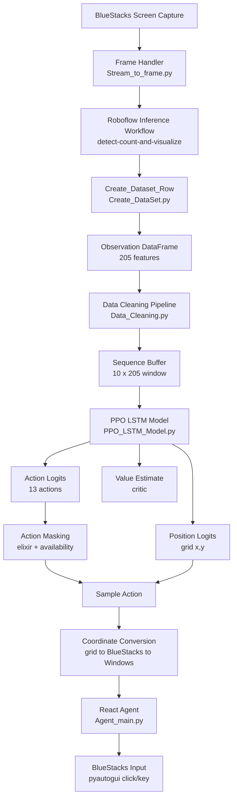
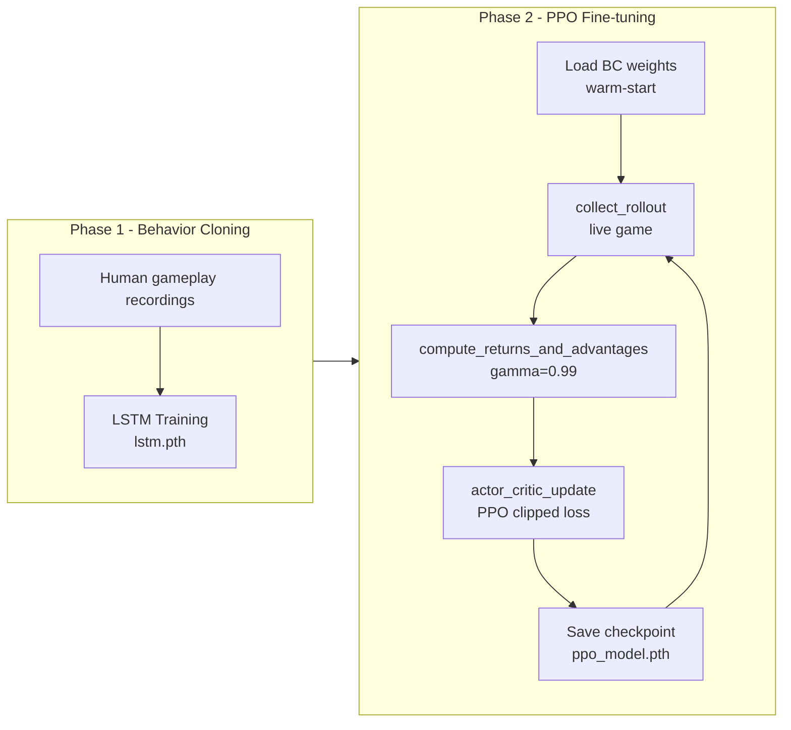

# Clash Royale RL Agent

> **An end-to-end reinforcement learning system that learns to play Clash Royale autonomously — from raw screen pixels to mouse clicks — without any game API or memory hacking.**

---

## What is this project?

Clash Royale is a real-time mobile strategy game where two players deploy troops and spells from a hand of cards to destroy each other's towers. Decisions must be made in seconds, card placement matters spatially, and resources (elixir) regenerate over time — making it a rich and non-trivial environment for an AI agent.

This project builds a full autonomous agent that:
- **Sees** the game through a custom Roboflow Inference Workflow running on live BlueStacks screen captures
- **Understands** the game state (troops on field, towers standing, elixir, cards in hand) as a structured observation vector
- **Decides** what card to play and where to place it using a deep LSTM policy network
- **Acts** by simulating real mouse clicks on the BlueStacks window via `pyautogui`

> **Current direction:** the project now focuses on the BC LSTM + PPO pipeline only. The earlier Decision Transformer experiment was removed because it did not match the direction we want for this project.

### Why is this interesting?

Most game AI research either uses privileged access (game memory, built-in APIs) or simplified environments. This agent operates purely from **visual perception + structured feature extraction**, the same information a human player has. It also tackles several challenges that make it technically non-trivial:

- **Partial observability**: the agent only sees one frame at a time; the LSTM maintains temporal context across a 10-frame sliding window
- **Mixed action space**: discrete card selection + continuous 2D placement on a spatial grid
- **Legal action constraints**: cards can only be played if they are in hand and elixir is sufficient — requiring hard action masking at every step
- **Sparse + delayed rewards**: most steps have near-zero reward; the game outcome only resolves after several minutes
- **Warm-start from imitation**: rather than learning from scratch (which would take thousands of games), the policy is first trained via **Behavior Cloning** on recorded human gameplay, then fine-tuned with **PPO** to go beyond human demonstrations

This makes it a practical example of the full modern RL stack: perception, feature engineering, imitation learning, and online policy optimization in a real-time game environment.

### Current limitations

- **Computer vision bottleneck:** the project currently has no GPU acceleration for the CV stage, so the agent's understanding of the environment is delayed by roughly **4–5 seconds**. That means it cannot react to actions immediately.
- **Limited behavior cloning data:** the LSTM is trained on only **70 matches**, which is very limited for behavior cloning. It needs to be retrained with more match data for better results.
- **Limited detection scope:** the CV model currently only recognizes a subset of card classes and arenas. It has not been trained to detect every card, so the agent is restricted to the supported set.
- **Small team:** only two people have worked on the AI side so far, so more contribution is needed to improve the dataset and vision pipeline.

---

## Architecture Overview



---

## Training Pipeline



---

## Project Structure

```
clash-royale-rl-agent/
│
├── Ai/
│   ├── Agent/
│   │   ├── Agent_main.py               # react_agent: executes actions via pyautogui
│   │   ├── coordinate_utils.py         # grid -> BlueStacks -> Windows coord conversion
│   │   └── LSTM_Inference_Pipeline.py  # BC inference pipeline
│   │
│   ├── Behavior_Cloning/
│   │   ├── LSTM_Model.py               # BC LSTM architecture
│   │   ├── LSTM_Train.py               # BC training script
│   │   ├── action_masking_config.py    # Shared masking config (AVAIL_FEATURE_TO_ACTION_ID)
│   │   └── lstm.pth                    # Trained BC weights (warm-start)
│   │
│   ├── RL/
│   │   ├── PPO_LSTM_Model.py           # Actor-critic LSTM (loads BC weights)
│   │   ├── PPO_Trainer.py              # clean_obs, build_action_mask, actor_critic_update
│   │   ├── PPO_Main.py                 # Main loop: collect -> update -> save
│   │   ├── ClashRoyalEnv.py            # Gym-style environment wrapper
│   │   ├── Reward_System.py            # compute_step_reward (tower presence diff)
│   │   ├── PPO_Logger.py               # JSON logging: updates, rollouts, win rate
│   │   └── logs/
│   │       ├── updates.json            # One entry per training run
│   │       ├── rollouts.json           # One entry per rollout
│   │       └── winrate.json            # Win/loss/draw history
│   │
│   ├── Roboflow/                       # Roboflow Inference SDK wrappers (troops, towers, elixir, slots)
│   ├── ClashRoyalData.py               # ElixirCost, card metadata, feature schemas
│   ├── Create_DataSet.py               # Builds observation row from a game frame
│   ├── Data_Cleaning.py                # final_clean pipeline (slot, positions, avab)
│   ├── Stream_to_frame.py              # Captures BlueStacks frame to temp PNG
│   ├── check_status.py                 # Win/loss detection from screen
│   └── State_Tracker.py
│
├── requirements.txt
├── .env.example
└── README.md
```

---

## Observation Space

Each game frame is processed by `Create_DataSet.py` into a structured feature dict, then cleaned by `Data_Cleaning.py` into a **205-feature numeric vector**:

| Feature group | Type | Description |
|---|---|---|
| `slot_1..4` | string (cleaned away) | Cards currently in hand — used to compute `*_avab` flags, then dropped |
| `Elixir` | int 0–10 | Current elixir count |
| `ally_prince_tower_left/right` | binary 0/1 | Whether the ally princess tower is still standing |
| `ally_king_tower` | binary 0/1 | Whether the ally king tower is still standing |
| `enemy_prince_tower_left/right` | binary 0/1 | Whether the enemy princess tower is still standing |
| `enemy_king_tower` | binary 0/1 | Whether the enemy king tower is still standing |
| `{troop}_ally/enemy` | binary 0/1 | Whether this troop type is currently on the field |
| `{troop}_ally/enemy_x/y` | grid int | Position on the 9×18 arena grid (converted from pixel coords) |
| `{ally}_ally_enemy_{enemy}_d` | float | Euclidean pixel distance between each ally-enemy troop pair (11×11 = 121 values). Set to -1 if either troop is absent |
| `{card}_avab` | binary 0/1 | Whether this card can be played right now (in hand AND elixir >= cost) |

> **Tower features are binary presence flags, not HP values.** `1` = tower is standing, `0` = tower has been destroyed. This is the only tower information available from visual detection.

A sliding window of the last **10 frames** is stacked into a `[10, 205]` tensor as LSTM input.

---

## Action Space

13 discrete actions:

| ID | Action |
|---|---|
| 0 | Wait |
| 1 | Play Mini Pekka |
| 2 | Play Knight |
| 4 | Play Goblins |
| 5 | Play Giant |
| 6 | Play Spear Goblins |
| 7 | Play Archers |
| 9 | Play Minions |
| 10 | Play Musketeer |
| 11 | Play Goblin Cage |
| 3, 8, 12 | Reserved / unmapped |

Card actions are accompanied by a continuous `(grid_x, grid_y)` placement position sampled from a Normal distribution, converted through: **arena grid -> BlueStacks virtual pixels -> Windows global screen coords** before execution.

---

## Action Masking

Three layers prevent the agent from playing cards it cannot legally play:

1. **Availability mask** — built from `*_avab` features. A card is legal only if it is currently in `slot_1..4` AND `elixir >= card_cost` (computed inside `card_avable()` in `Data_Cleaning.py`).
2. **Elixir safety guard** — a direct check at sampling time: `current_elixir - 1 >= card_cost`. The `-1` buffer accounts for the elixir read being one tick behind the live game state.
3. **Force-wait fallback** — if a card action passes both checks but is still unaffordable (edge case), `action_val` is replaced with `WAIT_ID = 0` before passing to `react_agent`.

The same masks used during rollout collection are **stored in the rollout dict** and reapplied during the PPO update so that the old and new policy distributions are computed over identical legal action sets.

---

## Reward System

Rewards are computed in `Reward_System.py` at every step by comparing consecutive observations:

- **Step reward**: tower presence diff between frames. If an enemy tower goes from `1` to `0` (destroyed) that step gets a large positive reward. If an ally tower is lost, negative reward.
- **Terminal reward**: `+1` on win, `-1` on loss, `0` on draw (configured in `ClashRoyalEnv`).

Returns-to-go are computed backwards with `gamma = 0.99` and advantage is `A_t = G_t - V(s_t)`.

---

## PPO Update

The `actor_critic_update` function in `PPO_Trainer.py` implements standard clipped PPO:

```
L = L_policy + 0.5 x L_value + L_entropy
```

- **Policy loss**: clipped surrogate with epsilon = 0.2
- **Value loss**: MSE between predicted values and discounted returns
- **Entropy bonus**: coefficient 0.01, encourages exploration
- **Gradient clipping**: max norm 0.5
- **Optimizer**: Adam with lr = 1e-4, state preserved across runs via checkpoint

The LSTM shared body + actor head + critic head are all updated jointly in a single backward pass.

---

## Logging

Every training run writes to `Ai/RL/logs/`:

### `updates.json` — one entry per run
```json
{
  "update_id": 7,
  "timestamp": "2026-05-30T00:00:00",
  "num_rollouts": 3,
  "total_steps": 240,
  "outcome": "win",
  "policy_loss": 0.0412,
  "value_loss": 0.1823,
  "mean_reward": 0.043,
  "explained_var": 0.61,
  "action_dist": { "wait": 180, "knight": 34, "musketeer": 18, "archers": 8 }
}
```

### `rollouts.json` — one entry per rollout
Per-rollout stats: steps, total reward, mean return, mean value estimate, forced-wait count, action distribution.

### `winrate.json` — running win/loss/draw history
Used to compute all-time and rolling win rates for dashboard display.

---

## Requirements

- Windows 10/11
- BlueStacks 4 (with Clash Royale installed)
- Python 3.11
- NVIDIA GPU recommended for faster inference

```bash
pip install -r requirements.txt
```

Key dependencies: `torch`, `pyautogui`, `opencv-python`, `pandas`, `numpy`, `inference-sdk`, `roboflow`

---

## Run Guide

### 1. Setup

```bash
cd clash-royale-rl-agent
pip install -r requirements.txt
Copy-Item .env.example .env   # fill in your Roboflow API key
```

### 2. Configure `.env`

```
ROBOFLOW_API_KEY=your_key_here
ROBOFLOW_API_URL=http://localhost:9001
ROBOFLOW_WORKSPACE=clashroyalbot-z9idj
ROBOFLOW_WORKFLOW_STATE=detect-count-and-visualize
```

### 3. Start BlueStacks

Open BlueStacks 4, launch Clash Royale, and navigate to the main menu. The agent will wait for a match to begin automatically.

### 4. Run BC inference only (no training)

```bash
python -m Ai.Agent.Agent_main
```

Runs the original behavior-cloned LSTM agent without any PPO updates.

### 5. Run PPO training

```bash
python -m Ai.RL.PPO_Main
```

- **First run**: loads BC weights from `Ai/Behavior_Cloning/lstm.pth` as warm-start
- **Subsequent runs**: automatically resumes from `Ai/RL/ppo_model.pth`

The training loop per run:
1. Waits for a Clash Royale match to begin
2. Collects one full rollout (one match) of transitions
3. Computes returns and advantages (`gamma = 0.99`)
4. Runs PPO update (clipped surrogate + value + entropy)
5. Saves checkpoint and writes logs
6. Repeats on next run

### 6. Reset to BC weights

```bash
del Ai\RL\ppo_model.pth
```

The next run will restart PPO fine-tuning from the BC warm-start.

### 7. Quick start: first version with the LSTM agent only

If you only want to run the behavior-cloned LSTM agent first, use this minimal setup:

1. Install the dependencies:

   ```bash
   pip install -r requirements.txt
   ```

2. Make sure your `.env` file contains the Roboflow API key and local workflow URL.

3. Start BlueStacks 4 and open Clash Royale.

4. Run the LSTM agent:

   ```bash
   python -m Ai.Agent.Agent_main
   ```

5. Optional smoke test with a screenshot:

   ```bash
   python -m Ai.Behavior_Cloning.run_lstm_inference_test --img-path <path-to-screenshot> --model-path Ai/Behavior_Cloning/lstm.pth
   ```

This is the easiest way to verify the first version of the agent before touching PPO training.

## Notes

- Detection is handled by a **custom Roboflow Inference Workflow** (`detect-count-and-visualize`) accessed via `InferenceHTTPClient` from the `inference-sdk` package. A valid `ROBOFLOW_API_KEY` in `.env` is required.
- `temp_screens/` stores frame captures during inference and is not committed to git.
- All grid coordinates use a **9x18 arena grid**. `grid_to_pixel()` and `bluestacks_to_global_coords()` in `coordinate_utils.py` handle the full conversion chain back to screen clicks.
- The agent supports the **11-card pool** defined in `ClashRoyalData.py`. Adding new cards requires updating `ElixirCost`, `AVAIL_FEATURE_TO_ACTION_ID`, and retraining the BC model.
- Tower features are **binary (0/1)**, not HP percentages. The reward signal for tower damage is therefore sparse — it only fires when a tower is fully destroyed in a given step transition.
- A contributor guide for adding new match datasets and improving the CV model will be added later. Those are the two highest-impact areas for helping the project grow.
